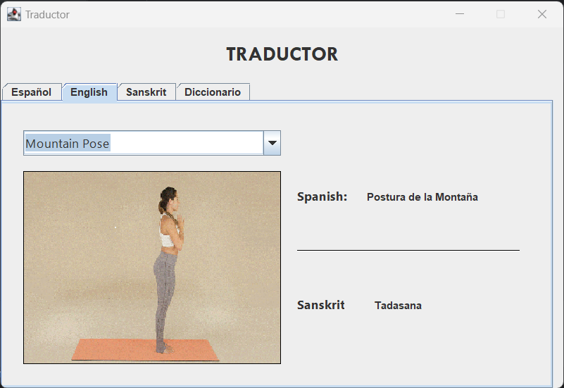
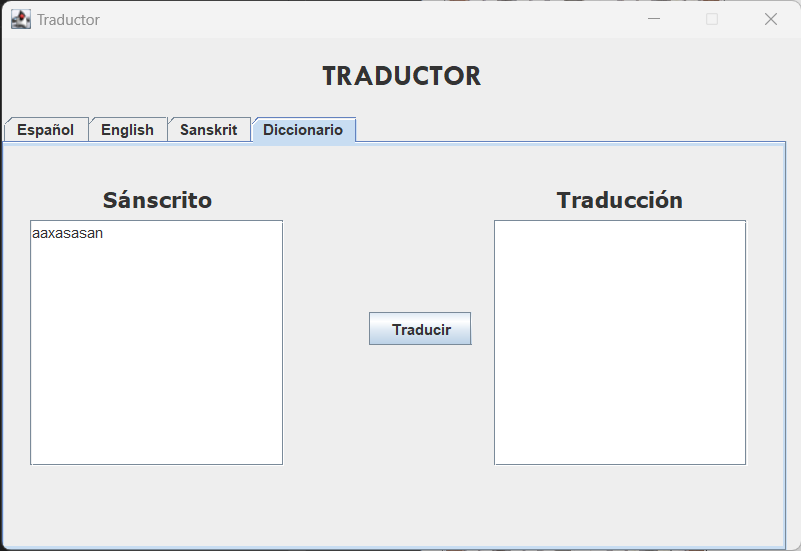

# Casos de prueba en base a requisitos

## 1. Traducción de nombres de posturas de yoga

* **Objetivo:** Verificar que el sistema traduzca correctamente el nombre de una postura de yoga del idioma inglés al sánscrito y español.

  * **Resultados Esperados:**

    

  * **Cumple:** ✅

## 2. Ingreso y traducción de posturas en sánscrito

* **Objetivo:** Confirmar que el sistema permita ingresar una postura de yoga en sánscrito y obtenga su traducción al inglés y español.

  * **Resultados Esperados:**

    

  * **Cumple:** ✅

## 3. Precisión en la traducción de nombres de posturas

* **Objetivo:** Verificar que el sistema traduzca de manera precisa el nombre de una postura de yoga del idioma español al sánscrito e inglés.

  * **Resultados Esperados:**

    

  * **Cumple:** ✅

## 4. Visualización gráfica de posturas de yoga

* **Objetivo:** Asegurar que el sistema permita visualizar las posturas de yoga de manera gráfica en la interfaz.

  * **Resultados Esperados:**

    

  * **Cumple:** ✅

## 5. Accesibilidad sin conexión a internet

* **Objetivo:** Confirmar que el sistema sea accesible al traductor incluso sin conexión a internet.

  * **Resultados Esperados:**

    

  * **Cumple:** ✅

## 6. Interfaz simple y fácil de utilizar

* **Objetivo:** Verificar que la interfaz del sistema sea simple y fácil de utilizar.

  * **Resultados Esperados:**

    

    

  * **Cumple:** ✅

## 7. Autocompletar durante la entrada del nombre de la postura

* **Objetivo:** Confirmar que el sistema ofrezca la opción de autocompletar mientras se escribe el nombre de la postura.

  * **Resultados Esperados:**

    

  * **Cumple:** ✅

## 8. Validación en la entrada de texto en la pestaña de Diccionario

* **Objetivo:** Verificar la validación en la entrada de texto en la pestaña de Diccionario.

  * **Resultados Esperados:**

    

    

  * **Cumple:** ❌
