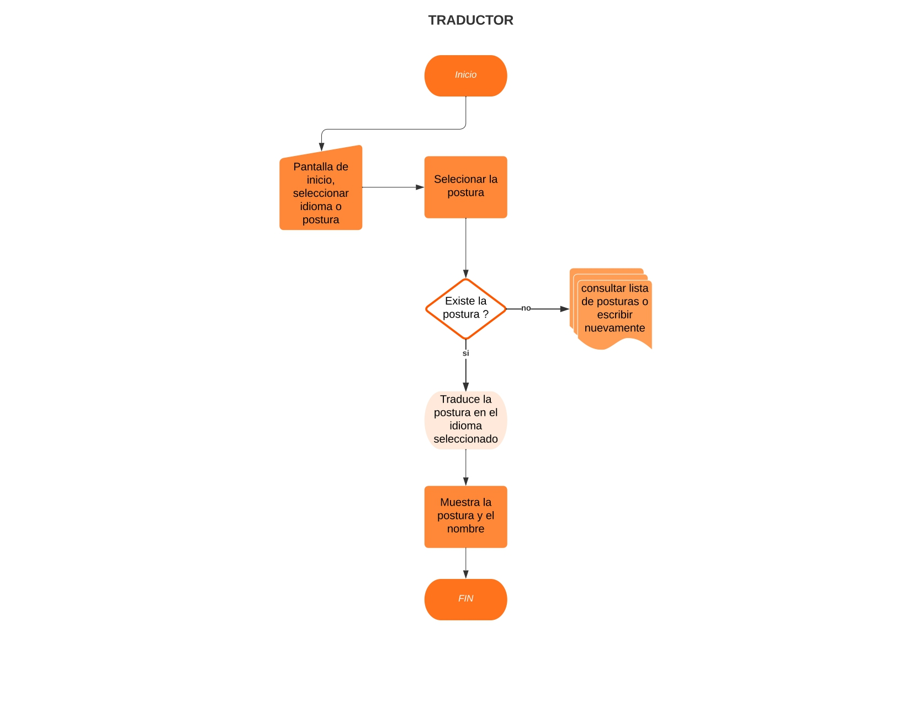
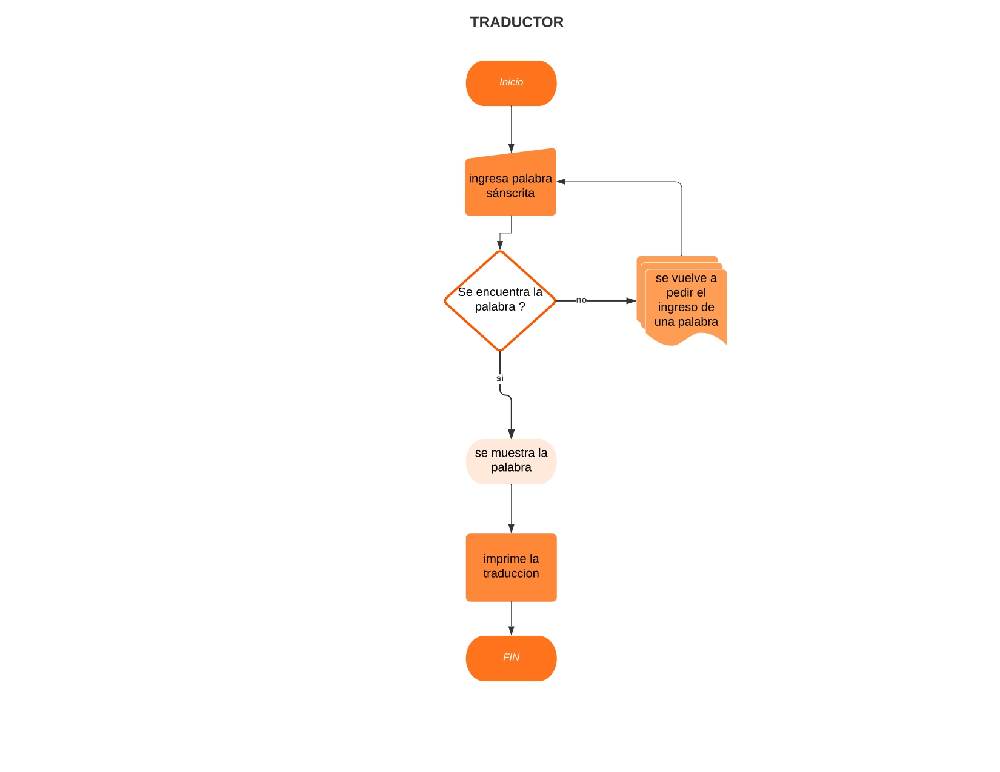

# Diagrama de Flujo

---
## Sección de traducciones fijas

Este tiene los siguientes pasos:
1. **INICIO**: se inicia la aplicación.
2. **Pantalla de inicio, seleccionar idioma y postura**: se muestra una pantalla para seleccionar el idioma y la postura de yoga.
3. **Selecciona la postura**: se elige la postura de traducción deseada.
4. **¿Existe la postura?**: se verifica si la postura de traducción existe o no.
5. **Traducir la postura del idioma seleccionado**: si la postura existe, se traduce el texto.
6. **Muestra la postura y el nombre**: se muestra la traducción y la imagen de la postura.
7. **FIN**: se termina el proceso de traducción.

## Sección de traducción manual

Este tiene los siguientes pasos:
1. **INICIO**: se inicia la aplicación.
2. **Ingresa palabra sánscrita**: el usuario ingresa una palabra en sánscrito que quiere traducir al español.
3. **¿Se encuentra la palabra en el diccionario?**: el programa busca la palabra en el diccionario.
4. **Se muestra la palabra**: si la palabra se encuentra en el diccionario, el programa la reemplaza por la traducción correspondiente.
5. **FIN**: el programa termina el proceso.

