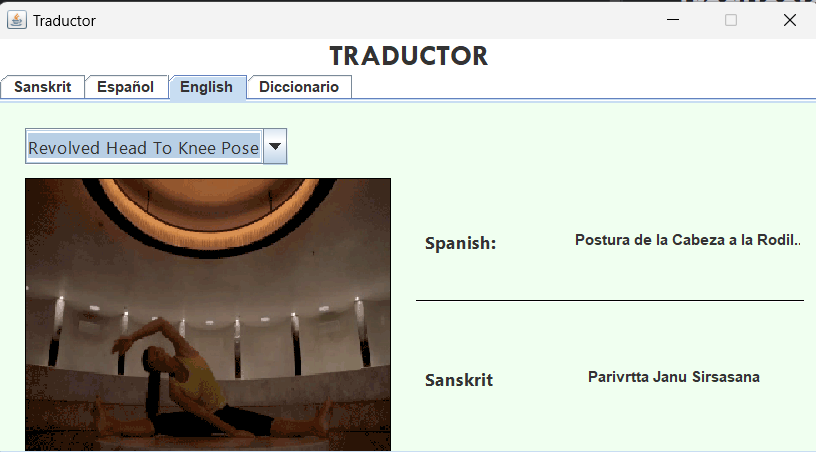
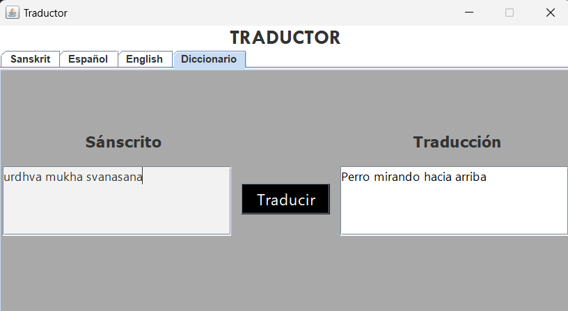
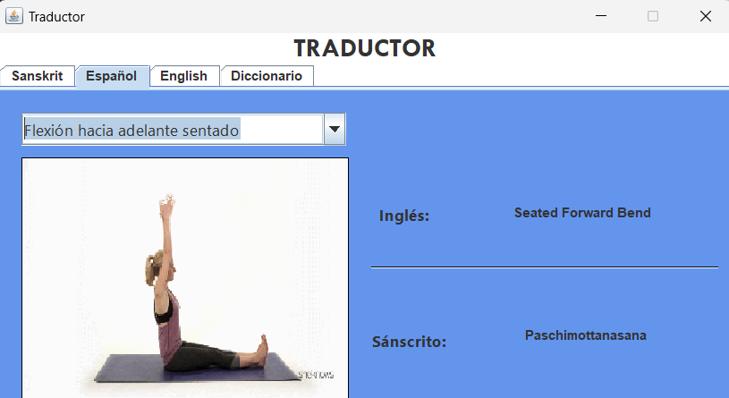
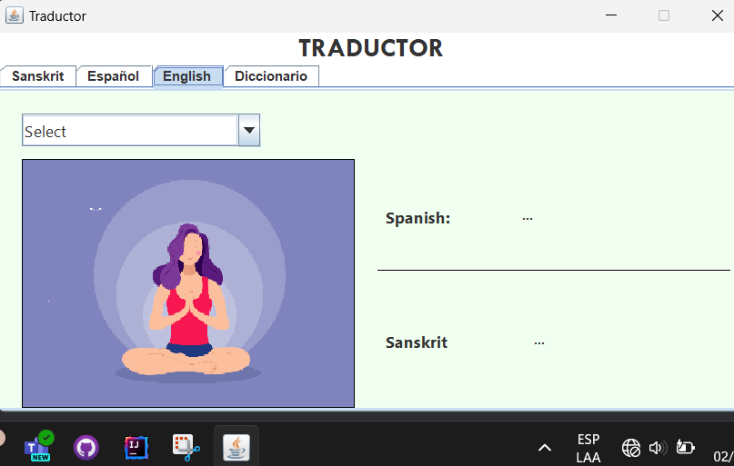
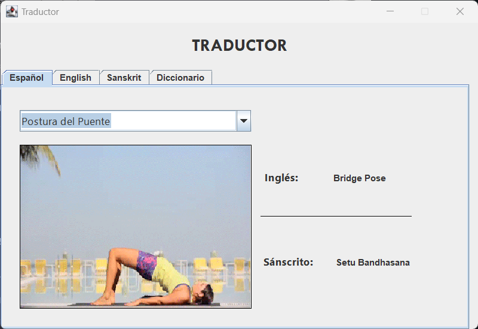
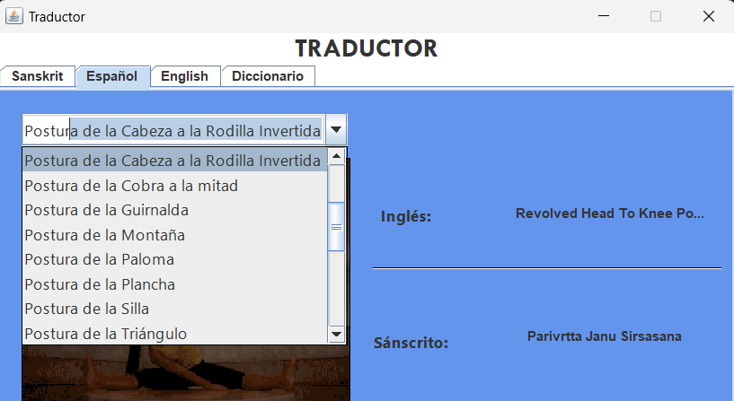
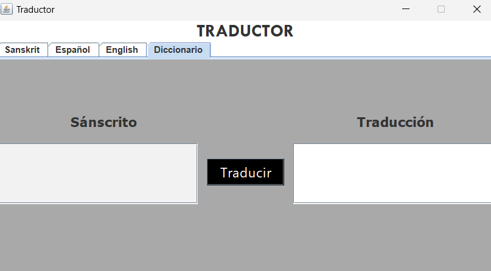

# Documentación de Ejecución de Pruebas

## Resumen de Ejecución

**Resultados Generales:**
- Total de Casos de Prueba Ejecutados: 7
- Casos de Prueba Exitosos: 7
- Casos de Prueba Fallidos: 0

## Casos de Prueba

### Caso de Prueba 1: Verificar Traducción Correcta

**Estado:** Exitoso

### Caso de Prueba 2: Ingresar Postura en Sánscrito

**Estado:** Exitoso

### Caso de Prueba 3: Visualización Gráfica de Posturas

**Estado:** Exitoso

### Caso de Prueba 4: Acceso sin Conexión a Internet

**Estado:** Exitoso

### Caso de Prueba 5: Usabilidad de la Interfaz

**Estado:** Exitoso

### Caso de Prueba 6: Autocompletar en la Búsqueda

**Estado:** Exitoso

### Caso de Prueba 7: Validación en la Entrada de Texto

**Estado:** Exitoso

