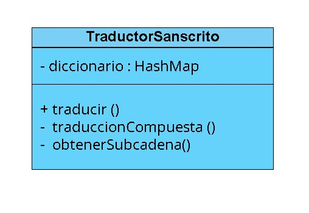

# Diagrama de Clases

### Métodos:
- traducir(String palabraSanskrita): Devuelve la traducción de una palabra sánscrita, ya sea directa o compuesta.
- traduccionCompuesta(String palabraSanskrita): Descompone y traduce palabras sánscritas compuestas.
<<<<<<< HEAD
- obtenerSubcadenas(String palabra): Obtiene todas las subcadenas posibles de una palabra.
=======
- obtenerSubcadenas(String palabra): Obtiene todas las subcadenas posibles de una palabra.

>>>>>>> origin/dev-joel
