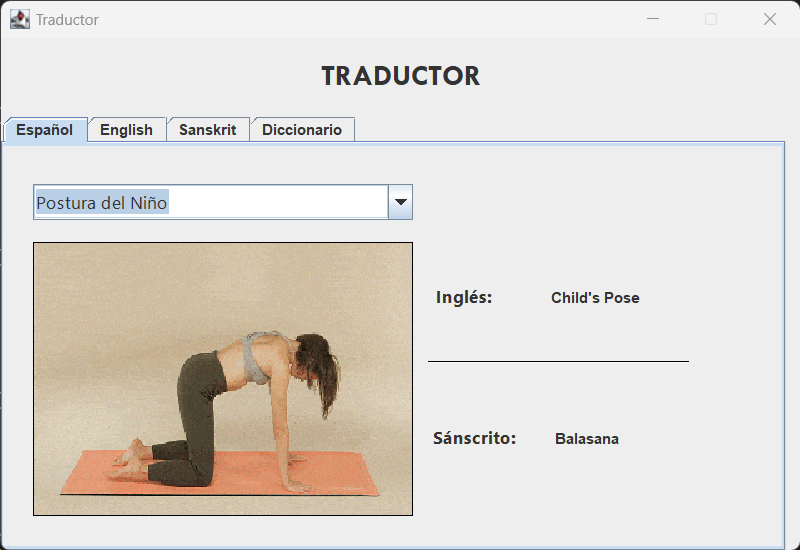

#Casos de prueba en base a requisitos

* Verificar que el sistema traduzca correctamente el nombre de una postura de yoga del idioma inglés al sánscrito y español.

    * Resultados:

    

    * Cumple: ✅ 

* Confirmar que el sistema permita ingresar una postura de yoga en sánscrito y obtenga su traducción al inglés y español.

    * Resultados:

    

    * Cumple: ✅ 

* Verificar que el sistema traduzca de manera precisa el nombre de una postura de yoga del idioma español al sánscrito e inglés.

    * Resultados:

    

    * Cumple: ✅ 

* Asegurar que el sistema permita visualizar las posturas de yoga de manera gráfica en la interfaz.

    * Resultados:

    

    * Cumple: ✅ 

* Confirmar que el sistema sea accesible al traductor incluso sin conexión a internet.

    * Resultados:

    

    * Cumple: ✅ 

* Verificar que la interfaz del sistema sea simple y fácil de utilizar.

    * Resultados:

    

    

    * Cumple: ✅

* Confirmar que el sistema ofrezca la opción de autocompletar mientras se escribe el nombre de la postura.

    * Resultados:

    

    * Cumple: ✅

* Verificar la validación en la entrada de texto en la pestaña de Diccionario.

    * Resultados:

    

    

    * Cumple: ❌